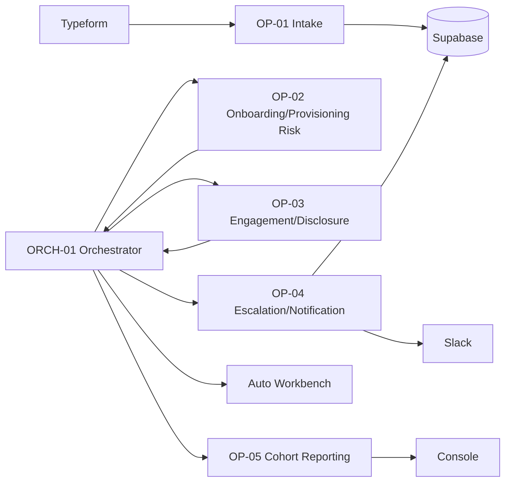

# Onboarding & Retention AI Employee
### Supervity Autopilot Asia Hackathon 2026 — Track 5 (HR & People Ops)

This repository is the planning and reference package for a **live, no-code AI Employee** built on the
Supervity Auto platform for Round 1 of the Autopilot Asia Hackathon. It orchestrates five Operator
Agents to monitor a 90-day new-hire onboarding journey, detect risk (missing IT access, stalled
compliance docs, disengagement, sensitive disclosures), act automatically on the clear cases, and route
every judgment call to a human.

If you're new to this project, **read in this order**:

1. `CONTEXT.md` — the immutable knowledge base: official rules, problem statement, and the actual
   dataset contents. Everything else in this repo assumes you've read this first.
2. `docs/MASTER_PLAN.md` — the strategy: why the project is shaped the way it is, phase-by-phase.
3. `docs/ARCHITECTURE.md` — the system design, with diagrams.
4. `docs/OPERATORS.md` — the implementation spec for each of the 5 Operators + the Orchestrator.
5. `docs/TASKS.md` — the granular, ready-to-execute implementation backlog.

The remaining documents (`docs/DATA_FLOW.md`, `docs/INTEGRATIONS.md`, `docs/DEMO.md`,
`docs/DECISIONS.md`, `docs/RISKS.md`) are reference material, cross-linked from the five above — read
them when the document you're in points you there, not necessarily front-to-back.

---

## What This Project Is

**Not** a chatbot. **Not** a single prompt-based agent. A governed, multi-agent system —
`ORCH-01` coordinating `OP-01` through `OP-05` — that runs against real, live-connected systems
(Supabase, Slack, Typeform), enforces business logic the team defines itself, and escalates
genuine exceptions to a human at the Auto Workbench instead of guessing. Full rationale in
`docs/MASTER_PLAN.md` §1, §6.

## What This Project Is Not (Explicit Scope Boundaries)

- **Not a Round 2 codebase.** Round 2's coded Auto Manager Console (NextJS/FastAPI/Docker starter repo)
  is out of scope until it's released to finalists on 25 July — see `docs/ARCHITECTURE.md` §10.
- **Not tuned to the public sample dataset.** Every rule, threshold, and test is written to generalize
  to an unseen hidden dataset with the same schema — see `docs/MASTER_PLAN.md` §10 and
  `docs/DATA_FLOW.md` §10. If you find yourself hardcoding a specific `Employee_ID` or comment string
  anywhere outside a test file, stop — that's the one thing this project is explicitly designed to
  avoid.
- **Not using Google integrations** (Drive, Sheets, Gmail, Calendar) — these are beta-excluded for this
  event; see `docs/INTEGRATIONS.md` and `RISKS.md` R-08.

## Repository Structure

```
supervity-ai-employee/
├── README.md                       ← you are here
├── CONTEXT.md                      ← immutable knowledge base (rules, problem statement, dataset facts)
├── docs/
│   ├── MASTER_PLAN.md              ← strategy, phases, success criteria
│   ├── ARCHITECTURE.md             ← system design + diagrams
│   ├── OPERATORS.md                ← per-Operator implementation spec
│   ├── DATA_FLOW.md                ← data lifecycle, confidentiality contract
│   ├── INTEGRATIONS.md             ← external system details
│   ├── TASKS.md                    ← implementation backlog
│   ├── DEMO.md                     ← demo script and judge-question prep
│   ├── DECISIONS.md                ← architectural decision records (ADR-001–012)
│   └── RISKS.md                    ← risk register
├── config/
│   └── policy_config.json          ← thresholds, routing, templates (shape defined in ARCHITECTURE.md §7)
├── scripts/
│   └── seed_loader/                ← reseeding utility (spec in DATA_FLOW.md §6, tasks in TASKS.md Phase 3)
└── dataset/
    ├── hr_enterprise_export.xlsx
    └── csv/
        ├── 00_INDEX.csv
        ├── Field_Dictionary.csv
        ├── Manager_Directory.csv
        ├── Onboarding_Tasks.csv
        ├── Peakon_Engagement.csv
        └── Provisioning_Integration.csv
```

`config/` and `scripts/` are specified by this documentation package but not yet implemented — see
`docs/TASKS.md` Phase 0 (config) and Phase 3 (reseeding utility) for the concrete build tasks.

## System at a Glance



Full diagrams and every component's responsibility: `docs/ARCHITECTURE.md`.

## The Five Operators (One Line Each)

| Operator | Job |
|---|---|
| OP-01 | Validate, normalize, and dedupe new-hire intake |
| OP-02 | Detect onboarding-task and IT-provisioning risk |
| OP-03 | Detect engagement risk and sensitive disclosures |
| OP-04 | Own every outbound notification and case-record write |
| OP-05 | Compute cohort-level business metrics |
| ORCH-01 | Coordinate all of the above; own all branching and escalation decisions |

Full specs: `docs/OPERATORS.md`.

## Qualification Gate Status (Live-Verified)

| Gate criterion | Status |
|---|---|
| Not a single mega-agent | ✅ 1 Orchestrator + 5 Operators, all built and saved |
| ≥3 integrations, ≥2 categories, incl. 1 channel + 1 SoR | ✅ Supabase (SoR) + Slack (channel) + Typeform (forms) — 3 integrations, 3 categories: exactly the gate minimum with zero spare integration margin (Airtable fully deprecated, GitHub is bonus-only and not counted, `docs/DECISIONS.md` ADR-001 second amendment Consequence 2) |
| ≥1 live exception to Auto Workbench | ✅ Verified live: `EMP7000` → `TASK_ALREADY_ESCALATED` → `workbench_log`, OP-04 subworkflow call confirmed via its own run audit |
| Parallel/branching/stateful demonstrable | ✅ Verified live: OP-02 ∥ OP-03 confirmed overlapping by raw timestamp (`EMP7000`); all 5 routing branches independently confirmed with real data (`EMP7000`/`EMP7018`/`EMP7035`/`EMP7003`/`EMP9999`) |

This was a design-time claim as of the planning package; it is now backed by live execution evidence
pulled from raw Activity Timeline logs — see `docs/TASKS.md` `2.2.1`–`2.2.10` for the full verification
record and `docs/DECISIONS.md` ADR-018 for why raw logs, not chat summaries, are the standard of proof
used throughout.

## Key Design Commitments (Non-Negotiable, Referenced Throughout)

1. **Never crash, never invent a value — escalate.** (`docs/MASTER_PLAN.md` §6, enforced per-Operator in
   `docs/OPERATORS.md`)
2. **Sensitive disclosures never reach the general cohort report**, structurally, not by convention.
   (`docs/DATA_FLOW.md` §7 — read this before touching anything related to OP-03 or OP-05)
3. **Every threshold and routing rule is external config, not hardcoded logic.**
   (`docs/ARCHITECTURE.md` §7)
4. **Nothing is tuned to the public sample dataset.** (`docs/MASTER_PLAN.md` §10)

## Current Status / Next Action

**Round 1 build is functionally complete.** All 5 Operators (`OP-01` intake, `OP-02` onboarding/
provisioning risk, `OP-03` engagement/disclosure, `OP-04` escalation/notification) plus `ORCH-01`
(orchestrator) are built, saved, and live in the Supervity Auto workspace. All 5 routing branches are
independently verified against real seeded data — `workbench_log` (`EMP7000`), `it_escalation`
(`EMP7018`), `manager_nudge` (`EMP7035`), `confidential_disclosure` (`EMP7003`), and `none`/no-data
(`EMP9999`) — with proof pulled from raw Activity Timeline / Execution Logs, not chat summaries (see
`docs/DECISIONS.md` ADR-018 for why that distinction matters here). Full task-by-task status:
`docs/TASKS.md`.

**Known, disclosed gaps (not oversights — see `docs/TASKS.md` and `docs/RISKS.md` R-28 for the full
reasoning):**
- OP-03's `SURVEY_NON_RESPONSE` rule (`TASKS.md` `1.3.3`) is not implemented, after repeated
  implementation attempts produced unreliable results; OP-03's other two rules (low engagement score,
  sensitive disclosure) are fully working and verified.
- The low-confidence-disclosure uncertainty branch (`TASKS.md` `2.2.6`) was not built as a distinct
  routing path — no real test case ever produced a sub-threshold classifier confidence, so it was never
  exercised.
- OP-05 (cohort dashboard) and the schedule-triggered full-cohort sweep (`TASKS.md` Phase 4, `2.2.8`/
  `2.2.10`) were descoped for time; Round 1's evidence for "quantified business output" rests on the
  individually-verified case outcomes above rather than an aggregate dashboard or an automated 60-worker
  sweep.
- The Phase 3 adversarial-dataset rehearsal was not completed; the closest available robustness proof
  is `EMP9999` (an employee ID that doesn't exist anywhere in the seed data), verified to resolve
  cleanly through the full pipeline with no crash and no fabricated finding.

**Next action, if time remains:** `docs/TASKS.md` Phase 5 (demo recording, LinkedIn post, submission
portal) is the remaining critical path — see `docs/DEMO.md` for the full, already-adapted script using
the verified employee IDs above.

## Timeline Anchor

Round 1 online sprint: **18–20 July 2026**. Internal submission target: **19 July, 18:00 MYT** (18 hours
of margin before the real 20 July 12:00 MYT deadline — see `docs/MASTER_PLAN.md` §12). Full timeline:
`CONTEXT.md` §2.
