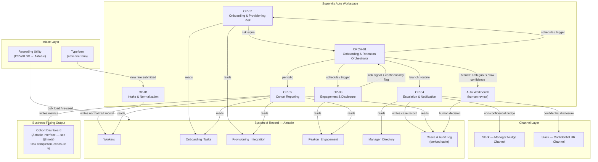
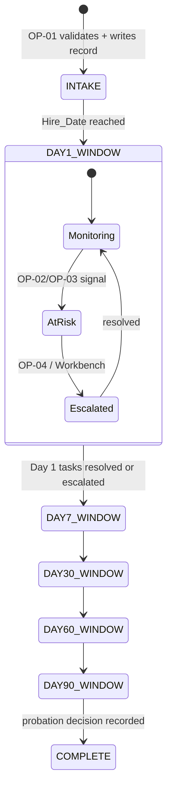

# ARCHITECTURE.md — System Architecture

**Reads as prerequisite:** `CONTEXT.md`, `MASTER_PLAN.md`
**Extended by:** `OPERATORS.md` (per-operator spec), `DATA_FLOW.md` (data lifecycle),
`INTEGRATIONS.md` (external systems), `DECISIONS.md` (ADRs referenced inline as `ADR-xxx`)

---

## 1. High-Level Architecture



**Reading the diagram:** the Orchestrator never touches an external system directly except to trigger
Operators and read Operator outputs — every external read/write is owned by exactly one Operator. This
is the "who calls what" invariant referenced throughout `OPERATORS.md`.

> **Unverified platform assumptions.** This architecture depends on four Supervity Auto platform
> capabilities that are assumed, not yet confirmed, at design time: (1) the Auto Workbench can receive a
> programmatic escalation carrying arbitrary case context and later write a resolution back; (2) Auto's
> execution trace UI actually surfaces OP-02/OP-03's parallel execution visibly, since `TASKS.md` 2.2.2
> makes "observably concurrent" a P0 acceptance criterion; (3) native Auto connectors exist for all
> three required integrations (Airtable, Slack, Typeform) — if any is missing, that integration silently
> becomes a Path 2 code Operator instead of Path 1 native (`CONTEXT.md` §5), which is still compliant
> but changes the build task's complexity; (4) a Round-1-appropriate surface exists for the `DASH` node
> above. On (4): Supervity's coded "Auto Manager Console" is explicitly a **Round 2** artifact
> (`CONTEXT.md` §3), so OP-05's Round 1 output surface is assumed to be an **Airtable Interface** (a
> read-only view over the `Cases & Audit Log` and metrics fields) rather than any Auto-native dashboard
> feature — the diagram's `DASH` node is labeled accordingly. All four are resolved by a dedicated
> Phase-0 platform spike **before** any of the five Operators are built, not discovered mid-build — see
> `TASKS.md` Phase 0, Epic 0.0.

---

## 2. Component Responsibilities (One Line Each)

| Component | Type | Responsibility | Full spec |
|---|---|---|---|
| OP-01 | Operator | Validate, normalize, and dedupe incoming new-hire records | `OPERATORS.md` §OP-01 |
| OP-02 | Operator | Detect onboarding/provisioning risk (missing access, stalled docs) | `OPERATORS.md` §OP-02 |
| OP-03 | Operator | Detect engagement risk and sensitive disclosures | `OPERATORS.md` §OP-03 |
| OP-04 | Operator | Own all outbound notification + case-record writes | `OPERATORS.md` §OP-04 |
| OP-05 | Operator | Compute and publish cohort-level business metrics | `OPERATORS.md` §OP-05 |
| ORCH-01 | Orchestrator | Coordinate the above, branch on combined risk, escalate | `OPERATORS.md` §ORCH-01 |
| Auto Workbench | Platform feature | Human-in-the-loop review surface (not built by team) | `CONTEXT.md` §5 |

---

## 3. Orchestration Design

### 3.1 Trigger model

Two independent trigger paths, both entering the same Orchestrator logic:

1. **Event-triggered (per hire, real-time):** a new record lands in `Workers` (via OP-01 from Typeform,
   or via the reseeding utility) → Orchestrator runs the full risk-assessment cycle for that one hire
   immediately.
2. **Schedule-triggered (cohort-wide, periodic):** once per demo/day cycle, Orchestrator sweeps every
   *active* hire (defined in §5, State Model) and re-runs the risk-assessment cycle for each, then calls
   OP-05 once at the end of the sweep.

Both paths converge on the same per-hire subroutine (§4), so there is exactly one place risk logic lives
— avoiding the classic bug class of "real-time path and batch path silently disagree."

### 3.2 Why one Orchestrator, not one per trigger type

A single Orchestrator with two entry conditions (rather than two separate Orchestrators) keeps the
branching/escalation logic in one auditable place, which directly serves the "technical architecture"
rubric line (`MASTER_PLAN.md` §4.2) and the auditability bonus (`MASTER_PLAN.md` §4.5). See
`DECISIONS.md` ADR-004 for the full alternatives analysis (monolith vs. two-orchestrator vs. one
Orchestrator).

---

## 4. Per-Hire Execution Lifecycle

```mermaid
sequenceDiagram
    participant ORCH as ORCH-01
    participant OP2 as OP-02 (Onboarding/Provisioning)
    participant OP3 as OP-03 (Engagement/Disclosure)
    participant OP4 as OP-04 (Escalation)
    participant WB as Auto Workbench

    ORCH->>OP2: assess(hire_id)
    ORCH->>OP3: assess(hire_id)
    Note over OP2,OP3: run in parallel (fan-out)
    OP2-->>ORCH: risk_signal_A {reasons[], tier (advisory only)}
    OP3-->>ORCH: risk_signal_B {reasons[], confidential:boolean, confidence}
    Note over ORCH: fan-in — union of reasons[] from both signals;<br/>ORCH is the ONLY place routing is decided (§6 table)

    alt confidential = true
        ORCH->>WB: escalate(case, confidential=true)
        Note right of WB: hard override — bypasses every branch below, always
    else OP3 disclosure-confidence < threshold on a possible disclosure
        ORCH->>WB: escalate(case, reason="low-confidence classification")
    else TASK_ALREADY_ESCALATED present, or both OP-02 and OP-03 fired (compounding)
        ORCH->>WB: escalate(case, reason="already-escalated or compounding risk")
        Note right of WB: source system, or two independent detectors,<br/>already judged this needs a human — see CONTEXT.md §12.2
    else exactly one MEDIUM-weight reason from OP-02 or OP-03
        ORCH->>OP4: route(case, channel=manager or IT)
    else no reasons from either Operator
        ORCH->>ORCH: log_and_continue(case)
    end
```

This sequence is the concrete realization of the example flow sketched in the problem statement
(`CONTEXT.md` §9, "Pulse & cadence → On track? → Provision & tasks / Detect risk → Human review") —
the team's own design, not a required template, but intentionally recognizable to judges who read the
same problem statement.

---

## 5. State Model — the 90-Day Clock

State is **not** held in the workflow; it is derived, at read time, from `Hire_Date` (Workers) plus the
timestamped rows in `Onboarding_Tasks` and `Peakon_Engagement`. This makes every run idempotent — the
same hire, re-evaluated twice, produces the same state unless underlying data changed.

> **⚠️ Load-bearing definition — the clock.** Every lateness rule in `OPERATORS.md` (OP-02 rules 1–4,
> OP-03 rule 2, OP-05's "tasks due-to-date") is of the form `as_of − Hire_Date > grace` or
> `as_of − Due_Date > overdue`. `as_of` is **not** silently "wall-clock now." It is an explicit field,
> `policy_config.as_of_date` (§7), read by every Operator instead of the system clock directly. Two
> reasons this must be a config value, not an implicit `now()`:
> 1. **Reproducibility.** If the demo is recorded on one day and judged on another, wall-clock `now()`
>    would change which hires are "at risk" between the two runs — the exact class of bug
>    `DATA_FLOW.md` §10 already calls out for timezone handling, applied to the clock itself.
> 2. **Hidden-dataset safety.** `CONTEXT.md` §4.3 guarantees "different records," not a guarantee about
>    which date range those records fall in. If the hidden dataset reuses a fixed historical date range
>    (like the public sample's `2026-05-16`–`2026-08-04` spread), wall-clock `now()` at judging time
>    could make every hire look >90 days in, or none at all, depending purely on when judging happens —
>    a failure mode that is invisible against a single-period public sample and only surfaces against
>    unseen data.
>
> Default: `as_of_date` defaults to true wall-clock `now()` **unless explicitly pinned**. It is
> explicitly pinned (i) for every automated test in `TASKS.md` (so tests are deterministic), and
> (ii) for the live demo recording (`DEMO.md` §6, pinned to a date inside the seeded dataset's active
> range so the pre-selected demo hires reliably show the expected risk state). During live judging —
> where the AI Employee must react to data as it actually arrives — `as_of_date` is left unpinned
> (real wall-clock), which is the correct behavior for a production-style system; pinning is a
> testing/demo-only device, not a production workaround.



`Milestone` (Day 1 / 7 / 30 / 60 / 90 — `CONTEXT.md` §12.2) is the discrete window label; risk
monitoring runs continuously *within* each window, not only at the window boundary, because a stalled
task or a low pulse score is actionable the moment it's detected, not only at the next milestone.

---

## 6. Branching Logic (Combined Risk Routing)

**Single routing authority:** OP-02 and OP-03 each emit a `tier` field (LOW/MEDIUM/HIGH,
`OPERATORS.md` §OP-02/§OP-03) that is **advisory only** — a human-readable severity label carried into
the audit log for readability, and nothing else. **ORCH-01 never routes on either Operator's `tier`.**
Routing is decided **exclusively** from the union of `reasons[]` codes returned by OP-02 and OP-03,
against the table below. This single-authority rule removes the ambiguity of an earlier draft that had
both OP-02's own tier and a separately-computed "combined tier" — see `DECISIONS.md` ADR-013.

| Condition (evaluated in this exact order — first match wins) | Confidential? | Route | Why |
|---|---|---|---|
| OP-03 confirms `confidential = true` | **yes** | **Direct to confidential HR Slack channel + a case entry logged to the Auto Workbench**, bypassing every rule below | Confidentiality is a hard override, evaluated first (`DATA_FLOW.md` §7) |
| OP-03's disclosure classifier confidence < `disclosure_classifier_min_confidence` on a possible disclosure | no (unconfirmed) | **Auto Workbench** (fail-safe) | A human must read the actual comment; auto-deciding either way is unsafe (`OPERATORS.md` §OP-03 Retry Behavior) |
| `TASK_ALREADY_ESCALATED` present, **or** both OP-02 and OP-03 fired a reason on the same hire (compounding risk) | no | **Auto Workbench** — human review, **not** a Slack nudge | The source system (`Status = Escalated`, `CONTEXT.md` §12.2) or two independent detectors already judged this needs a person; routing it to a Slack nudge instead would silently downgrade a signal the system of record — or the system itself — already raised |
| Exactly one MEDIUM-weight reason (`MISSING_DAY_ONE_ACCESS`, `PROVISIONING_DELAYED`, `LOW_ENGAGEMENT_SCORE`, or `SURVEY_NON_RESPONSE` alone) | no | `OP-04` → manager nudge (Slack, manager channel, resolved by `Org` — see routing table below) | Single, routine signal — safe for automated action |
| No reasons from either Operator | no | Log & continue (no action, no case record) | Nothing to act on |

**Why this table is gate-safe on its own:** the Workbench-routed row (`TASK_ALREADY_ESCALATED` /
compounding risk) is reachable directly from the public sample data — `CONTEXT.md` §12.2 confirms 40
`Escalated` rows exist — so the gate-mandatory live exception (`CONTEXT.md` §5) does not depend on the
LLM classifier ever running low-confidence, giving the demo (`DEMO.md` §2 Beat 4) a reliable,
reproducible trigger.

### Manager-channel routing (fixes the Org vs. Job_Family trap)

Manager-nudge channel routing keys **only** on `Manager_Directory.Org`, resolved via the hire's
`Manager_WID` — **never** on `Workers.Job_Family`. These are two different, non-corresponding taxonomies
in the actual dataset (`CONTEXT.md` §12): `Manager_Directory.Org` has 5 values (`Finance`, `Sales`,
`Ops`, `Engineering`, `People`), while `Workers.Job_Family` has 4 different values (`Finance`,
`Technology`, `People`, `Operations`) that only partially overlap by name (`Ops` ≠ `Operations`,
`Engineering`/`Technology` don't match at all). Keying routing off the wrong field would silently
misroute or fail to resolve a channel for a large share of hires. `policy_config.routing` therefore
provisions one channel per `Manager_Directory.Org` value (5 channels), not per `Job_Family` — see §7.

Confidentiality is a **hard override**: it is evaluated first, before any other rule, and once true it
forecloses every other branch regardless of what OP-02 found. This ordering is deliberate — see
`DATA_FLOW.md` §7 for the full confidential-handling contract and `DECISIONS.md` ADR-005 for why
detection uses a classifier rather than keyword matching.

---

## 7. Configuration Layer

All tunable behavior lives in one versioned config object, `policy_config`, read by every Operator at
the start of its run (never hardcoded inline). Full field-by-field defaults and reasoning live in
`OPERATORS.md` next to the Operator that consumes each field; this section defines the **shape** only.

> **Where `policy_config` actually lives (config home):** for the Customizability rubric line (20%,
> `CONTEXT.md` §7) to mean anything, a business user must be able to edit this **without touching code**.
> The canonical, live copy of `policy_config` is therefore an **Airtable table** (or Auto's own config
> feature if the platform exposes one — confirm during the Phase-0 spike, `TASKS.md` Phase 0), edited
> the same way any other business-facing data is edited. The JSON shown below is a **reference schema
> and versioned export only** (e.g., for the repo's `config/policy_config.json`, `README.md`), useful
> for documentation and diffing changes over time, but it is not itself the thing a business user edits
> live during the demo (`DEMO.md` §8, "Could a business user really change this without an engineer?").

```jsonc
{
  "version": "1.0",
  "as_of_date": null,     // null = live wall-clock "now" (production behavior).
                            // Pinned to a fixed ISO date only for automated tests and the demo
                            // recording — see ARCHITECTURE.md §5 for why this must never be an
                            // implicit now() inside any Operator's own logic.
  "thresholds": {
    "provisioning_blocked_grace_days": 1,      // owned by OP-02
    "task_stalled_overdue_days": 3,             // owned by OP-02
    "compliance_step_terms": ["Compliance training assigned", "Compliance Document signed"], // owned by OP-02 — configurable term list, not a hardcoded substring match (see DECISIONS.md ADR-016)
    "engagement_low_score": 5,                  // owned by OP-03, scale 0–10
    "disclosure_classifier_min_confidence": 0.75 // owned by OP-03
  },
  "routing": {
    "manager_channel_by_org": {
      "Finance": "#hr-nudge-finance",
      "Sales": "#hr-nudge-sales",
      "Ops": "#hr-nudge-ops",
      "Engineering": "#hr-nudge-engineering",
      "People": "#hr-nudge-people"
    },                                           // keyed on Manager_Directory.Org (5 values) — NEVER Workers.Job_Family, see §6
    "confidential_channel": "#hr-confidential",
    "it_escalation_channel": "#it-provisioning"
  },
  "templates": {
    "manager_nudge": "...",
    "it_escalation": "...",
    "confidential_alert": "..."
  },
  "retry": {
    "max_attempts": 3,
    "backoff_seconds": [5, 20, 60]               // production default — see the separate demo profile below
  },
  "retry_demo_profile": {
    "max_attempts": 1,
    "backoff_seconds": []                         // used only when recording DEMO.md; a live demo cannot
                                                    // afford up to 85s of dead air per failed write chain
                                                    // waiting on the production backoff — see RISKS.md R-23
  }
}
```

**Why this satisfies Customizability (20% of the rubric):** a business user (or a judge role-playing
one) can change `engagement_low_score` from 5 to 6 **in the Airtable config table** and immediately
change which hires get flagged, without touching any Operator's internal logic — exactly the "point the
AI Employee at different incoming data, and still have it perform" requirement in `CONTEXT.md` §9.

---

## 8. Scalability Considerations

Round 1 scale is small (60 workers in the sample; hidden dataset assumed comparable order of magnitude
per `CONTEXT.md` §9 FAQ language — "point the AI Employee at different incoming data"). Design choices
made anyway, because they cost nothing at this scale and remove risk:

- **Parallel fan-out (OP-02 ∥ OP-03) is per-hire, not per-cohort** — the cohort sweep iterates hires and
  fans out per hire, so cohort size scales linearly with no architectural change needed.
- **No in-memory aggregation across the whole cohort until OP-05** — every other Operator is scoped to
  one hire at a time, so memory/complexity per Operator call is constant regardless of cohort size.
- **Airtable as system of record** has a documented API rate limit; OP-04's retry/backoff config
  (§7) exists partly to absorb this gracefully rather than to handle transient network failure alone.

## 9. Maintainability Considerations

- Every Operator has exactly one integration it writes to (OP-01→Airtable, OP-04→Slack+Airtable,
  OP-05→Airtable+Dashboard) — see the "who calls what" invariant (§2). This means an integration outage
  or credential rotation touches exactly one Operator's config, never a cross-cutting change.
- `policy_config` is versioned (`"version": "1.0"` field) so a future change can be diffed and audited —
  directly supports the auditability bonus.
- Naming convention `OP-XX` / `ORCH-XX` is stable across all documents in this package; any future
  Operator added in Round 2 continues the sequence (`OP-06`, …) rather than renumbering.

## 10. Round 2 Forward Notes (Non-Binding)

Round 2 introduces a coded Auto Manager Console on Auto Runtime and a GitHub starter repo
(NextJS/FastAPI/Docker), released to finalists on 25 July (`CONTEXT.md` §2). Because the starter repo's
actual structure is not yet known, this document **does not** design Round 2 code architecture — doing
so now would mean fabricating an undocumented API surface, which the project constraints explicitly
forbid. The only forward-compatible decision made now is that OP-05's metrics (§1, `DASH` node) are
already structured as a queryable data shape in Airtable, so a future coded console has a stable
contract to read from on day one of Round 2, regardless of what the starter repo's front end looks like.
