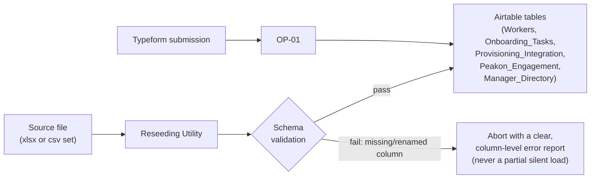
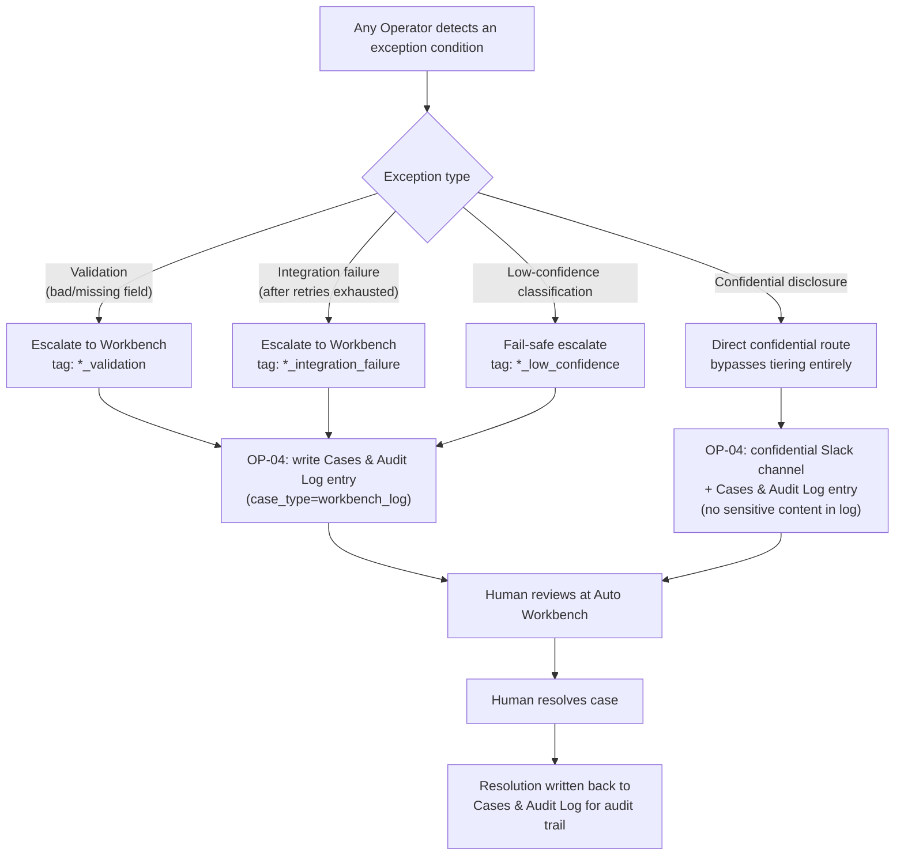

# DATA_FLOW.md — Data Lifecycle

**Reads as prerequisite:** `CONTEXT.md`, `ARCHITECTURE.md`, `OPERATORS.md`
**Purpose:** trace every unit of data from origin to rest, including the exception and confidential
paths that the problem statement treats as first-class requirements, not edge cases.

---

## 1. Data Sources

| Source | Nature | Enters via |
|---|---|---|
| Public sample dataset (`hr_enterprise_export.xlsx` + 6 CSVs, `CONTEXT.md` §11–§12) | Static files, team's own copy | Reseeding utility (§6) |
| Hidden judging dataset | Static files, same schema, unseen until judging | Reseeding utility (§6), re-run live |
| New-hire intake | Live, one record at a time | Typeform → OP-01 |
| Manager/HR actions at the Auto Workbench | Live, human-generated | Written back to `Cases & Audit Log` |

**Design implication:** because two structurally-identical-but-different datasets (public, hidden) must
both flow through the exact same pipeline with zero code changes, the reseeding utility and every
Operator's field access must be **schema-driven** (by column name) rather than **position- or
value-driven** (by column index or literal content). This is the single most important robustness
property in the whole system — see `MASTER_PLAN.md` §10.

---

## 2. Ingestion

Two ingestion paths exist (bulk file → utility, single record → OP-01) but they converge on the same
target tables and implement the same documented normalization rules (`OPERATORS.md` §OP-01) as two
independent implementations of one specification — not literally shared/invoked code across the
no-code/script boundary; see §6 and `DECISIONS.md` ADR-006's amendment.

---

## 3. Preprocessing & Normalization

Steps 1, 2, and 4 below apply uniformly regardless of ingestion path. Step 3 (fuzzy name-variant
resolution) does not — see the note under step 3.

1. **Whitespace/casing normalization** on all text fields (trims trailing whitespace — an explicitly
   named trap type, `CONTEXT.md` §4.5).
2. **Date normalization** across the known formats plus a defensive fallback parser
   (`DECISIONS.md` ADR-011) for formats not yet seen — every date field (`Hire_Date`, `Due_Date`,
   `Completed_Date`, `Requested_On`, `Fulfilled_On`, `Submitted_At`) goes through the same parser, since
   `CONTEXT.md` §12.4 confirms `Submitted_At` alone already has 3 formats in the public sample and other
   date fields are not guaranteed to be cleaner in the hidden set.
3. **Name-variant resolution** (`Legal_Name` vs `Preferred_Name` vs free-text intake name) via the
   fuzzy-dedup logic owned by OP-01 (`OPERATORS.md` §OP-01, `DECISIONS.md` ADR-012) — **live Typeform
   intake path only**. The bulk reseeding utility does not run this step against seed rows, since the
   seed file's workers are already distinct, verified records; see §6 for the full scope note.
4. **Type coercion with escalation on failure** — `Score` to numeric, `FTE` to numeric, `Employee_ID`/
   `Worker_WID`/`Manager_WID` treated as opaque strings (never parsed/coerced, since they are
   identifiers, not measures).

---

## 4. Validation

Validation is layered, matching the "don't crash, don't invent a value" rule (`CONTEXT.md` §6) at every
layer:

| Layer | Checks | On failure |
|---|---|---|
| Schema (ingestion) | Required columns present, correctly named | Abort load, report to operator (human running the reseed), §2 |
| Row (normalization) | Required fields non-empty after normalization, types coerce cleanly | Row-level escalation via OP-01 (new hires) or flagged-but-loaded with a data-quality tag (bulk historical rows — see §5) |
| Operator-level (business) | Field is present but is business-logic-invalid (e.g., `Score` out of 0–10 range) | Excluded from that specific calculation, logged, does not block the rest of the record (`OPERATORS.md` OP-02/OP-03 failure tables) |

**Why bulk historical rows are tagged-but-loaded rather than rejected (row-level layer):** the dataset
is described as containing deliberate messy/trap rows across `Onboarding_Tasks`, `Provisioning_Integration`,
and `Peakon_Engagement` (`CONTEXT.md` §4.5, §10) — these rows are the point of the exercise, not garbage
to discard. Only genuinely new-hire *intake* (OP-01's live path) escalates on failure, because a new
hire with an unparseable `Hire_Date` cannot safely start the 90-day clock at all. A historical task row
with a bad date is instead excluded from lateness math but the hire's other rows still evaluate
normally (`OPERATORS.md` §OP-02 Validation).

---

## 5. Transformation

The only cross-source transformation in the system is the **combined risk signal** built in ORCH-01 from
OP-02's and OP-03's independent outputs (`ARCHITECTURE.md` §4, §6). No other Operator transforms data
across more than one source table at a time — this is a direct consequence of the single-responsibility
design (`ARCHITECTURE.md` §2) and keeps every transformation traceable to exactly one rule in
`OPERATORS.md`.

---

## 6. Persistence & the Reseeding Utility

**Design decision (`DECISIONS.md` ADR-006):** a standalone, schema-driven loader that maps source
columns to Airtable fields **by name**, re-runnable at any time against any dataset matching the
documented schema (`CONTEXT.md` §12.6, `Field_Dictionary.csv`), including the hidden judging dataset.

Requirements on the utility (implementation detail for `TASKS.md`, not designed here beyond contract):
- Runs as a **local script** operated by the team (not an Auto Operator) — Supervity Auto's no-code
  workflow environment cannot literally share a runtime code module with a standalone script, so "shared"
  here means the utility implements the **same documented normalization rules** as OP-01
  (`OPERATORS.md` §OP-01, `DECISIONS.md` ADR-011/012) as an independent implementation of one
  specification, not shared code — see `DECISIONS.md` ADR-006 amendment for the corrected framing.
- Idempotent: re-running against the same file twice does not create duplicate rows (upserts on
  `Employee_ID`/`Worker_WID`/natural keys per table).
- Destructive-reset mode available for the live demo's "prove it on a new dataset" beat (`DEMO.md` §5) —
  clears derived tables (`Cases & Audit Log`) but never the raw source tables from a prior run unless
  explicitly requested, so a demo mistake doesn't destroy evidence of prior test runs.
- Applies text/date normalization (§3) per row during load, but **does not** run OP-01's fuzzy-dedup
  match against existing rows — the seed file's workers are already distinct, verified records
  (`CONTEXT.md` §12.1: 60 unique `Employee_ID`s), so a fuzzy-merge pass over already-distinct records
  only risks a false merge for no benefit. Fuzzy dedup is reserved for OP-01's live Typeform intake path.
  Exact-`Employee_ID` duplicate rows within one seed file are still deduped, by exact match, as part of
  the utility's own load logic (`DATA_FLOW.md` §9 "Duplicate rows" row).
- Emits a load report (rows loaded, rows flagged for data-quality, rows rejected at schema layer) so the
  team can visually confirm a re-seed worked before starting the live Orchestrator run in a demo.

---

## 7. Confidential Information Handling (Contract)

This is the single most safety-critical data-flow rule in the whole system, directly required by the
problem statement (`CONTEXT.md` §9: *"sensitive disclosures route confidentially"*) and by the index
note (`CONTEXT.md` §12.7: *"Sensitive-disclosure comments must route confidentially, never into the
cohort report"*).

**The contract:**

1. Raw `Comment` text from `Peakon_Engagement` is read by exactly one place: OP-03's classification
   step (`OPERATORS.md` §OP-03).
2. If classified confidential, the raw text is carried **only** inside `_internal_case_payload`, a field
   that:
   - is attached to the risk signal only when `confidential = true`,
   - is consumed only by OP-04's confidential-routing branch (`OPERATORS.md` §OP-04),
   - is **never** written to `reasons[]` (the field OP-05's cohort report reads from),
   - is **never** written to the `manager_nudge` or `it_escalation` message templates.
3. **OP-05's read scope permanently excludes the `Peakon_Engagement` table itself** — not just a filter
   applied to what it returns. `OPERATORS.md` §OP-05's Inputs list is `Workers`, `Onboarding_Tasks`,
   `Provisioning_Integration`, `Cases & Audit Log` only; `Peakon_Engagement` is not in that list.
   `INTEGRATIONS.md` §1's summary row for OP-05 must match this exactly — an earlier draft of that table
   said "OP-05 | all tables," which would have included `Peakon_Engagement` and directly contradicted
   this contract; that row has been corrected (`INTEGRATIONS.md` §1) to name OP-05's actual four-table
   read scope. This is what makes the guarantee structural: OP-05 has no input contract through which raw
   disclosure text could arrive, not a filter inside OP-05 that a future edit could accidentally remove.
   OP-05's exposure-rate metric (`OPERATORS.md` §OP-05) is computed fresh from `Onboarding_Tasks`/
   `Provisioning_Integration` using OP-02's rule definitions, and separately, `Cases & Audit Log` gives it
   only case existence/resolution status — never comment content, since OP-04 never writes raw disclosure
   text to that table either (§8 below).
4. Low-confidence *possible* disclosures fail safe to confidential (`OPERATORS.md` §OP-03 Retry
   Behavior) — the system is asymmetric on purpose: it is acceptable for a non-sensitive comment to be
   over-cautiously routed to a human, it is not acceptable for a sensitive disclosure to ever reach a
   general report.
5. The confidential Slack channel (`policy_config.routing.confidential_channel`) is a single,
   access-restricted channel — not routed by `Org` like manager nudges — limiting exposure to a small,
   defined HR audience (`OPERATORS.md` §OP-04, `DECISIONS.md` ADR-002).

**This contract is demoed explicitly and literally** — `DEMO.md` §6 requires showing the cohort report
*not* containing a disclosure that the confidential channel *did* receive, in the same demo take, so the
claim is falsifiable on camera rather than asserted.

---

## 8. Exception Flow (Full Trace)

**Why every escalation still produces an audit-log write, even Workbench escalations OP-04 didn't route
itself:** ORCH-01 always calls OP-04 with `case_type: workbench_log` for any escalation it initiates
directly (`ARCHITECTURE.md` §6, `OPERATORS.md` §ORCH-01), so the audit trail has no gaps — this is what
makes the auditability bonus (`MASTER_PLAN.md` §4.5) a true, complete trail rather than a partial one
covering only the automated-action cases.

---

## 9. Dirty Data & Duplicate Handling — Summary Table

Cross-reference to the exact rule and owning Operator for each named trap type (`CONTEXT.md` §4.5, §10),
so this table is the single place to look up "what handles X":

| Trap type | Owning layer | Rule reference |
|---|---|---|
| Name variants | OP-01 fuzzy-dedup | `OPERATORS.md` §OP-01, `DECISIONS.md` ADR-012 |
| Mixed date/currency formats | Shared normalization module (§3) | `DECISIONS.md` ADR-011 |
| Trailing whitespace | Shared normalization module (§3) | — |
| Blank fields | Per-Operator validation tables | `OPERATORS.md`, each Operator's "Validation" + "Failure Handling" sections |
| Duplicate rows | OP-01 dedup (new-hire path); reseeding utility upsert-by-natural-key (bulk path) | `OPERATORS.md` §OP-01, §6 above |
| Timestamps in different zones | Date normalization treats all parsed dates as date-only (day granularity) for milestone/lateness math, sidestepping timezone ambiguity entirely rather than attempting cross-zone reconciliation | `DECISIONS.md` ADR-011 |
| Missing day-one access | OP-02 rule 1 | `OPERATORS.md` §OP-02 |
| Stalled compliance doc | OP-02 rule 2 | `OPERATORS.md` §OP-02 |
| Disengaged hire | OP-03 rule 1 | `OPERATORS.md` §OP-03 |
| Sensitive disclosure in a pulse | OP-03 rule 3 + full confidential contract | §7 above, `OPERATORS.md` §OP-03/§OP-04 |

---

## 10. Hidden-Dataset Robustness — Data-Flow-Specific Notes

Beyond the general strategy in `MASTER_PLAN.md` §10, two data-flow-specific properties matter most:

1. **Column-name-driven mapping** (§1, §6) means a hidden dataset with reordered or additional columns
   (not just different values) still loads correctly — a stronger robustness bar than the rules
   strictly require, chosen deliberately because "different records and a higher share of tricky cases"
   (`CONTEXT.md` §4.3) does not explicitly rule out structural variation, and defending against it costs
   little.
2. **Day-granularity date handling** (§9, timezone row) removes an entire class of off-by-one bugs that
   would otherwise be the most likely source of a hidden-dataset failure, since timezone-related bugs are
   notoriously invisible against a single-timezone sample (the public dataset) and only surface against
   unseen data.
