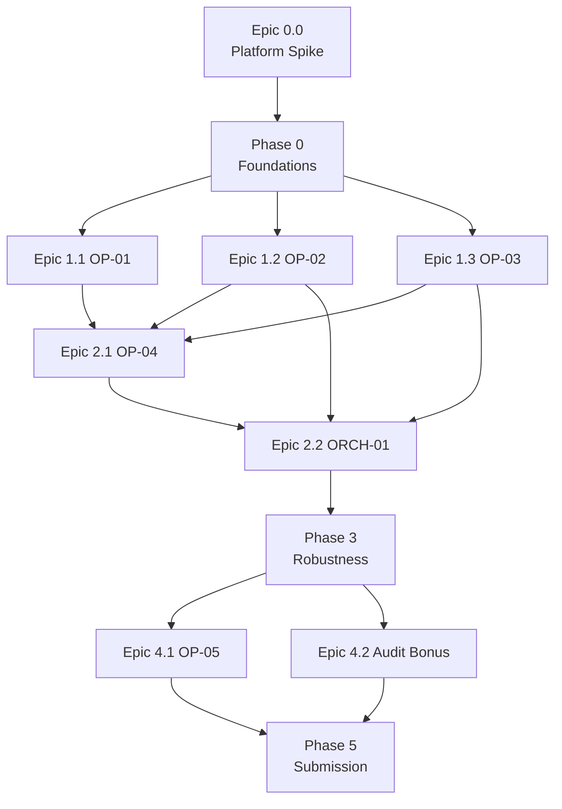

# TASKS.md — Implementation Backlog

**Reads as prerequisite:** all prior documents in this package. Every task below assumes the reader has
`CONTEXT.md`, `MASTER_PLAN.md`, `ARCHITECTURE.md`, `OPERATORS.md`, `DATA_FLOW.md`, `INTEGRATIONS.md`,
`DECISIONS.md` open for reference — tasks intentionally do not re-explain design decisions already
documented there.

**How to read this backlog:** work top to bottom within a phase; phases are sequential (Phase N+1 does
not start until Phase N's exit criteria in `MASTER_PLAN.md` §7 are met), except where a task is
explicitly marked `[PARALLELIZABLE]`. Each task is sized to be completed in one focused work session by
a single engineer (Claude Opus 4.8, working alone on that task).

**Priority key:** P0 = gate-blocking, must complete. P1 = rubric-scoring, strongly expected. P2 = bonus/
stretch, attempt only after all P0/P1 in earlier phases are done.
**Complexity key:** S (small, <1hr equivalent), M (moderate, 1–3hr equivalent), L (large, half-day
equivalent).
**Status key:** `Not Started` / `In Progress` / `Done` — updated as work lands; not a substitute for
running each task's own Acceptance Criteria before calling it Done.

---

## Phase 0 — Foundations

**Epic 0.0 — Platform Capability Spike** `[Blocking — must complete before Epic 0.1–1.3; see `DECISIONS.md` ADR-015]`

| ID | Status | Task | Priority | Complexity | Dependencies | Acceptance Criteria |
|---|---|---|---|---|---|---|
| 0.0.1 | Done | Confirm the Auto Workbench accepts a programmatic escalation carrying arbitrary case context, and that a human resolution at the Workbench can be written back to a system of record | P0 | S | None | A hand-built, throwaway test workflow successfully escalates one dummy case to the Workbench and the team confirms a resolution is retrievable afterward |
| 0.0.2 | Done | Confirm Auto's execution trace UI visibly surfaces two steps running in parallel (not just functionally concurrent under the hood) | P0 | S | None | A trivial 2-branch parallel test workflow shows both branches executing with visible overlap in Auto's own execution/trace view — this is required evidence for `TASKS.md` 2.2.2's acceptance criterion later, so confirm it can actually be shown before relying on it |
| 0.0.3 | Done | Confirm native Auto connectors exist for Airtable, Slack, and Typeform (Path 1, `CONTEXT.md` §5) | P0 | S | None | Each of the 3 shows up as a native connector option in Auto; for any that don't, immediately flag a fallback to a Path 2 code Operator and re-estimate that integration's build complexity before Phase 1 begins |
| 0.0.4 | Done | Decide OP-05's concrete Round 1 output surface | P0 | S | None | **Reopened and revised** (`DECISIONS.md` ADR-001 second amendment): originally an Airtable Interface; now **Supabase's Table Editor** (a filterable/sortable grid, not a computed-field dashboard) over `Cases_Audit_Log` and wherever OP-05 publishes its computed metrics, since `Cases_Audit_Log` moved off Airtable and Auto's coded Manager Console remains Round-2-only (`CONTEXT.md` §3) |

**Epic 0.0 Exit Criteria:** all four spikes resolved (confirmed working, or a documented fallback chosen)
before any task in Epic 0.1 begins. This epic is intentionally small and time-boxed (~30 minutes total)
— the goal is early, cheap discovery of platform gaps, not thorough platform testing.

**Epic 0.1 — Systems Provisioning** `[PARALLELIZABLE across subtasks]`

| ID | Status | Task | Priority | Complexity | Dependencies | Acceptance Criteria |
|---|---|---|---|---|---|---|
| 0.1.1 | Done | Create Airtable base with 6 tables matching `CONTEXT.md` §12 column names exactly for `Workers`, `Onboarding_Tasks`, `Provisioning_Integration`, `Peakon_Engagement`, `Manager_Directory`; plus new `Cases & Audit Log` table per `OPERATORS.md` §OP-04 output schema | P0 | M | 0.0.3 | All 6 tables exist; every column name matches source CSV headers exactly (verified by diffing against `Field_Dictionary.csv`); `Cases & Audit Log` has fields for timestamp, employee_id, case_type, channel, policy_rules_fired, outcome — **note:** every table was later migrated off this base to Supabase, see `0.1.5`/`0.1.6`; this Airtable base is now deprecated, kept only as historical record |
| 0.1.2 | Done | Create Slack workspace + **5 manager-nudge channels** (one per `Manager_Directory.Org` value: `Finance`, `Sales`, `Ops`, `Engineering`, `People` — see `ARCHITECTURE.md` §6 "Manager-channel routing" note; **not** `Workers.Job_Family`, a different, non-corresponding taxonomy), plus 1 IT-escalation channel, plus 1 confidential HR channel with restricted membership (7 channels total) | P0 | S | 0.0.3 | All 7 channels exist; confidential channel membership list reviewed by both team members; bot/app token generated; `policy_config.routing.manager_channel_by_org` populated with all 5 real channel IDs, not placeholders |
| 0.1.3 | Done | Create Typeform form matching OP-01 Inputs table fields (`OPERATORS.md` §OP-01) | P0 | S | 0.0.3 | Form live; test submission successfully produces a webhook payload with the 3 hard-required fields present (`Legal_Name`, `Hire_Date`, manager identification) — other fields are optional on the form by design, per `OPERATORS.md` §OP-01's trimmed required-field list |
| 0.1.4 | Done | Connect all 3 required integrations (Airtable, Slack, Typeform) inside the Supervity Auto workspace via native integration path (`CONTEXT.md` §5 Path 1) | P0 | M | 0.1.1–0.1.3 | All 3 show "connected" status in Auto; a trivial test workflow can read from Airtable and post to Slack — **note:** Airtable's native connection is now unused (`0.1.6`); historical record only |
| 0.1.5 | Done | Migrate `Workers`, `Manager_Directory`, `policy_config` from Airtable to Supabase (`DECISIONS.md` ADR-001 amendment); build `scripts/seed_loader/supabase_client.py`, wire `loader.py`/`schema.py` for per-table backend routing, migrate `seed_policy_config.py` | P1 | M | 0.1.1, 0.2.1 | `config/supabase_schema.sql` applied; live reseed run writes and independently verifies 60 `Workers` rows, 25 `Manager_Directory` rows, 22 `policy_config` rows in Supabase; existing 58-test seed_loader suite still passes unmodified |
| 0.1.6 | In Progress | Finish the migration: move `Onboarding_Tasks`, `Provisioning_Integration`, `Peakon_Engagement`, and `Cases & Audit Log` (recreated as `Cases_Audit_Log`) to Supabase; deprecate Airtable entirely (`DECISIONS.md` ADR-001 second amendment) | P1 | M | 0.1.5 | `config/supabase_schema.sql` extended and applied; live reseed writes and independently verifies 780 `Onboarding_Tasks`, 300 `Provisioning_Integration`, 140 `Peakon_Engagement` rows in Supabase; `loader.py` no longer requires Airtable credentials to run; existing 58-test suite still passes unmodified; `Cases_Audit_Log` table exists empty, ready for OP-04 |

**Epic 0.2 — Configuration & Shared Rules**

| ID | Status | Task | Priority | Complexity | Dependencies | Acceptance Criteria |
|---|---|---|---|---|---|---|
| 0.2.1 | Done | Author `policy_config` v1.0 as a config object/table per `ARCHITECTURE.md` §7, with every default value and its one-line justification (already drafted in `OPERATORS.md` per-Operator tables — transcribe, do not re-derive). **Must include `as_of_date` (default `null` = live wall-clock) and `retry_demo_profile`** — these are not optional fields, see `ARCHITECTURE.md` §5, §7 | P0 | S | 0.1.1 | Config object exists in a form editable without touching workflow logic (originally Airtable, now a Supabase table per `0.1.5`); every field from `ARCHITECTURE.md` §7 is present, including `as_of_date` and `retry_demo_profile` |
| 0.2.2 | Done | Build the date-normalization logic (multi-format parser) per `DECISIONS.md` ADR-011, used by every Operator that reads a date field (OP-01, OP-02, OP-03) **and** independently reimplemented in the reseeding utility (Phase 3) against the same rule set — not literally shared code across the no-code/script boundary, see `DECISIONS.md` ADR-006 amendment | P0 | M | None | Parses all 3 known formats (`2026-06-15 00:00:00`, `15/07/2026`, `Jun 21 2026`) plus 2 additional formats not in the public sample (e.g., `2026/06/15`, `June 21, 2026`), returns a clear "unparseable" signal (never a guessed date) on genuine garbage input |
| 0.2.3 | Done | Build the fuzzy-dedup logic per `DECISIONS.md` ADR-012 — **used by OP-01's live Typeform intake path only**; the reseeding utility does not run this against bulk seed rows, per `OPERATORS.md` §OP-01 scope note and `DECISIONS.md` ADR-006 amendment | P0 | M | None | Given 2 name strings with casing/whitespace/minor-spelling variance, returns a similarity score; tested against at least 5 hand-crafted variant pairs and 5 hand-crafted genuinely-different-person pairs, with zero false merges in the latter set |
| 0.2.4 | Done | Add `retry_demo_profile` to `policy_config` (1 attempt, no backoff) and wire every write-side Operator (OP-01, OP-04) to read `retry_demo_profile` instead of the production `retry` block when a `demo_mode` flag is set | P1 | S | 0.2.1 | Toggling `demo_mode` on measurably eliminates the up-to-85s dead-air risk from a failed write chain during a live take (`RISKS.md` R-23); production behavior (`retry`, 3 attempts, 5/20/60s backoff) is unaffected when `demo_mode` is off |

**Phase 0 Exit Criteria:** all systems connected and live; config and shared rules exist and pass their
own acceptance criteria above. (Matches `MASTER_PLAN.md` §7 Phase 0 row.)

---

## Phase 1 — Detection Operators

**Epic 1.1 — OP-01 Intake & Normalization** `[PARALLELIZABLE with Epic 1.2, 1.3]`

| ID | Status | Task | Priority | Complexity | Dependencies | Acceptance Criteria |
|---|---|---|---|---|---|---|
| 1.1.1 | Done | Build OP-01 field validation step per `OPERATORS.md` §OP-01 Inputs/Validation | P0 | M | 0.2.2 | All required-field checks implemented; missing/malformed required field routes to escalation, not a crash |
| 1.1.2 | Done | Wire date parsing (0.2.2) and manager resolution (against `Manager_Directory`) into OP-01 | P0 | M | 1.1.1, 0.2.2 | Unparseable `Hire_Date` escalates; ambiguous manager match (0 or >1 candidates) escalates |
| 1.1.3 | Done | Wire fuzzy-dedup (0.2.3) into OP-01's write path | P0 | M | 1.1.1, 0.2.3 | Above `dedup_confidence_threshold` → update existing record; below `dedup_flag_band_low` → create new; in between → escalate |
| 1.1.4 | Not Started | Wire Supabase write + retry/escalation per `OPERATORS.md` §OP-01 Retry/Failure tables (`DECISIONS.md` ADR-001 amendment — Workers moved off Airtable) | P0 | S | 1.1.1–1.1.3, 0.1.5 | Simulated Supabase failure (nonexistent table in the write URL) correctly retries 3x then escalates with tag `intake_integration_failure` |
| 1.1.5 | Not Started | Build the Typeform-poll Parent Workflow (0.1.3) that fans out to OP-01, per submission (`AUTO_BUILD_GUIDE.md` §B — Auto's Typeform integration polls rather than pushing an instant webhook) | P0 | S | 1.1.4, 0.1.4 | Live Typeform submission produces a correctly normalized `Workers` row within one poll cycle |
| 1.1.6 | Not Started | Unit test OP-01 against 5 hand-picked cases: clean new hire, name-variant duplicate, unparseable date, ambiguous manager, missing required field | P0 | M | 1.1.5 | All 5 cases produce the exact expected outcome (create / update / 3 distinct escalation types) |

**Epic 1.2 — OP-02 Onboarding & Provisioning Risk** `[PARALLELIZABLE with Epic 1.1, 1.3]`

| ID | Status | Task | Priority | Complexity | Dependencies | Acceptance Criteria |
|---|---|---|---|---|---|---|
| 1.2.1 | Not Started | Build read step for `Onboarding_Tasks` + `Provisioning_Integration` scoped to one `Employee_ID` | P0 | S | 0.1.1, 0.1.4 | Returns correct rows for a known test `Employee_ID`; returns empty (not error) for a hire with zero rows |
| 1.2.2 | Not Started | Implement rule 1 (missing day-one access) per `OPERATORS.md` §OP-02 Business Logic | P0 | M | 1.2.1, 0.2.2 | Against `EMP7000`'s known `Blocked` Laptop/System Access rows (`CONTEXT.md` §12.3 sample), correctly fires `MISSING_DAY_ONE_ACCESS` |
| 1.2.3 | Not Started | Implement rule 2 (stalled compliance doc) | P0 | M | 1.2.1, 0.2.2 | Against a hand-picked `Escalated`-status compliance task (`CONTEXT.md` §12.2 sample has 40 `Escalated` rows), correctly fires `STALLED_COMPLIANCE_DOC` or `TASK_ALREADY_ESCALATED` as appropriate |
| 1.2.4 | Not Started | Implement rules 3–4 (already-escalated passthrough, provisioning stuck in Requested) | P0 | S | 1.2.1 | Both rules independently testable against hand-picked rows |
| 1.2.5 | Not Started | Implement tier aggregation logic | P0 | S | 1.2.2–1.2.4 | 0/1/2+ reasons map to LOW/MEDIUM/HIGH exactly per the aggregation table |
| 1.2.6 | Not Started | Wire retry/escalation for read failures per `OPERATORS.md` §OP-02 Failure Handling | P1 | S | 1.2.1, 0.1.4 | Simulated read failure retries 3x then escalates `op02_integration_failure` |
| 1.2.7 | Not Started | Unit test OP-02 against 5 hand-picked hires covering each reason code at least once, plus 1 clean (LOW) hire | P0 | M | 1.2.5, 1.2.6 | All 5+1 cases produce expected tier + reason codes |

**Epic 1.3 — OP-03 Engagement & Disclosure** `[PARALLELIZABLE with Epic 1.1, 1.2]`

| ID | Status | Task | Priority | Complexity | Dependencies | Acceptance Criteria |
|---|---|---|---|---|---|---|
| 1.3.1 | Not Started | Build read step for `Peakon_Engagement` scoped to one `Employee_ID` | P0 | S | 0.1.1, 0.1.4 | Returns correct rows; empty result handled as valid non-response state, not an error |
| 1.3.2 | Not Started | Implement rule 1 (disengaged hire / low score) | P0 | M | 1.3.1, 0.2.1 | Against a hand-picked low-score row (e.g., the `Score: 2` "disconnected and unsure" sample referenced in `CONTEXT.md` §12.4), correctly fires `LOW_ENGAGEMENT_SCORE` |
| 1.3.3 | Not Started | Implement rule 2 (survey non-response) | P0 | M | 1.3.1 | Against the 1 worker with zero Peakon rows (`CONTEXT.md` §12.4: "59 of 60 workers"), correctly fires `SURVEY_NON_RESPONSE` at the appropriate milestone window |
| 1.3.4 | Not Started | Build the LLM disclosure classifier prompt and wire it as OP-03's classification step, per `OPERATORS.md` §OP-03 rule 3 | P0 | L | 1.3.1 | Against the 2 sample comments referenced in `CONTEXT.md` §12.4 (health matter not yet raised; teammate-treatment concern), both correctly classify `confidential: true` above threshold; against 5 clearly-routine comments (e.g., "Smooth onboarding."), all correctly classify `confidential: false` |
| 1.3.5 | Not Started | Implement the confidentiality-first output contract: `_internal_case_payload` attached only when confidential, never leaking into `reasons[]` | P0 | M | 1.3.4 | Automated check: for every confidential test case, assert `reasons[]` contains zero substrings from the raw `Comment` field |
| 1.3.6 | Not Started | Implement fail-safe-to-confidential behavior on classifier low confidence / call failure | P0 | S | 1.3.4 | Simulated classifier failure produces `confidential: true, confidence: 0`, never `confidential: false` |
| 1.3.7 | Not Started | Implement tier aggregation (independent of confidentiality flag) | P0 | S | 1.3.2, 1.3.3 | 0/1/2+ reasons map to LOW/MEDIUM/HIGH exactly |
| 1.3.8 | Not Started | Unit test OP-03 against 5 hand-picked hires: 1 clean, 1 low-score, 1 non-response, 1 confidential-disclosure, 1 borderline/ambiguous comment | P0 | M | 1.3.5–1.3.7 | All 5 produce expected tier, reason codes, and confidentiality flag; confidential case's `reasons[]` contains no raw comment text (automated string-search assertion) |

**Phase 1 Exit Criteria:** OP-01, OP-02, OP-03 each independently pass their unit test rows (Phase 1
exit criteria in `MASTER_PLAN.md` §7).

---

## Phase 2 — Orchestration & Action

**Epic 2.1 — OP-04 Escalation & Notification**

| ID | Status | Task | Priority | Complexity | Dependencies | Acceptance Criteria |
|---|---|---|---|---|---|---|
| 2.1.1 | Done | Build channel/manager resolution logic per `OPERATORS.md` §OP-04 Business Logic step 1 | P0 | M | 0.1.1, 0.2.1 | Given a hire with a valid `Manager_WID`, resolves correct `Org`-based Slack channel; given an unresolvable manager, escalates `op04_routing_unresolved` |
| 2.1.2 | Done | Build message templating for `manager_nudge`, `it_escalation`, `confidential_disclosure` case types | P0 | M | 2.1.1, 0.2.1 | Rendered messages contain only non-sensitive fields; automated assertion confirms `_internal_case_payload` content never appears in a rendered manager/IT template |
| 2.1.3 | Done | Wire Slack send with retry/escalation per `OPERATORS.md` §OP-04 Retry/Failure tables | P0 | M | 2.1.2, 0.1.4 | Simulated Slack failure retries 3x, then escalates `op04_notification_failure`, and still attempts the audit-log write independently |
| 2.1.4 | Done | Build `Cases & Audit Log` write for every case type, including `workbench_log` (logging escalations OP-04 didn't route itself) | P0 | M | 2.1.3, 0.1.1 | Every case type produces exactly one audit log row with timestamp, case type, channel used (or "workbench" for direct escalations), and which policy rule(s) fired |
| 2.1.5 | Done | Unit test OP-04 against all 4 case types plus 1 unresolved-routing case plus 1 simulated-Slack-failure case | P0 | M | 2.1.4 | All 6 cases produce correct routing/escalation and a correct audit log entry |

**Epic 2.2 — ORCH-01 Orchestrator**

| ID | Status | Task | Priority | Complexity | Dependencies | Acceptance Criteria |
|---|---|---|---|---|---|---|
| 2.2.1 | Not Started | Build event-triggered entry point (single `employee_id`) | P0 | S | Phase 1 complete | Given a test `employee_id`, triggers OP-02 and OP-03 |
| 2.2.2 | Not Started | Build parallel fan-out to OP-02 + OP-03 | P0 | M | 2.2.1 | Both Operators' calls are observably concurrent (not sequential) in Auto's execution trace — this is required, verifiable evidence for the "parallel" gate criterion, not just a claim |
| 2.2.3 | Not Started | Build fan-in / reason-code union routing logic per `ARCHITECTURE.md` §6 table (single routing authority — reads only `reasons[]` from OP-02/OP-03, never either Operator's `tier`, per `DECISIONS.md` ADR-013) | P0 | L | 2.2.2 | All 5 rows of the routing table produce the documented route, tested against 5 constructed input combinations |
| 2.2.4 | Not Started | Implement confidentiality-first override ordering | P0 | M | 2.2.3 | A case with `confidential: true` AND a `TASK_ALREADY_ESCALATED` reason present still routes to the confidential channel only — confidentiality is checked and wins before the already-escalated/compounding-risk rule is ever evaluated |
| 2.2.5 | Not Started | Implement the already-escalated / compounding-risk branch → Auto Workbench (not Slack) | P0 | M | 2.2.4 | A hire with a `TASK_ALREADY_ESCALATED` reason routes to the Workbench, not a manager-nudge Slack message — this is the gate-mandatory live exception path and must not silently degrade to a notification (`DECISIONS.md` ADR-013) |
| 2.2.6 | Not Started | Implement the low-confidence-disclosure uncertainty branch → Auto Workbench | P0 | M | 2.2.4 | A constructed case with OP-03's classifier `confidence` below `disclosure_classifier_min_confidence` on a possible disclosure routes to the Workbench, never to log-and-continue or to a manager notification — OP-02's `confidence` (fixed at 1.0) never triggers this branch |
| 2.2.7 | Not Started | Implement partial-signal handling (one Operator escalated, other succeeded) per `OPERATORS.md` §ORCH-01 Validation | P1 | M | 2.2.3 | Simulated OP-02 integration failure with OP-03 succeeding still produces a routing decision from OP-03's signal alone, not a blocked/stuck hire |
| 2.2.8 | Not Started | Build schedule-triggered cohort-sweep entry point, iterating all active hires through 2.2.1–2.2.7's logic | P0 | M | 2.2.7 | A manual/scheduled trigger correctly processes all 60 sample workers with zero crashes and zero skipped hires |
| 2.2.9 | Not Started | Wire OP-04 calls for every branch outcome, including `workbench_log` for direct escalations | P0 | S | 2.2.4–2.2.8, Epic 2.1 | Every branch in 2.2.3's test matrix results in the correct OP-04 call |
| 2.2.10 | Not Started | End-to-end integration test: full 60-worker cohort sweep | P0 | L | 2.2.8, 2.2.9 | Completes without crash; produces at least 1 example of each: log-and-continue, manager nudge, IT escalation, confidential routing, Workbench escalation via `TASK_ALREADY_ESCALATED` (may require hand-picking which hires to include if the public sample doesn't naturally contain all 5 — acceptable to supplement with 1–2 synthetic test rows for this specific test, clearly marked as test-only, never mixed into the seeded production data) |

**Phase 2 Exit Criteria:** end-to-end run on full cohort completes without crash; at least 3 branch types
observed live (`MASTER_PLAN.md` §7 Phase 2 row).

---

## Phase 3 — Robustness & Hidden-Dataset Rehearsal

| ID | Status | Task | Priority | Complexity | Dependencies | Acceptance Criteria |
|---|---|---|---|---|---|---|
| 3.1 | Done | Build the reseeding utility per `DATA_FLOW.md` §6 contract | P0 | L | Phase 0 | Loads the public sample dataset cleanly; is idempotent on re-run (no duplicates); emits a load report |
| 3.2 | Done | Extend reseeding utility with schema validation (abort-with-report on missing/renamed column) | P0 | M | 3.1 | Deliberately rename one column in a test copy of the CSVs; utility aborts with a clear, specific error, does not partial-load |
| 3.3 | Not Started | Author the adversarial rehearsal dataset: same schema, denser trap density (more name variants, more blank fields, more duplicate rows, at least 2 unseen date formats, at least 1 structurally reordered/extra-column file) | P1 | L | None (can start in parallel with Phase 2) | Dataset file(s) created, reviewed by both team members against the trap-type checklist in `DATA_FLOW.md` §9 |
| 3.4 | Not Started | Run the full pipeline (reseed → cohort sweep) against the adversarial dataset | P0 | M | 3.2, 3.3, Phase 2 complete | Zero crashes; every deliberately-planted trap produces the correct escalation or classification (validated by hand against the known-answer key the team wrote when authoring 3.3) |
| 3.5 | Not Started | Fix any gaps found in 3.4 | P0 | Varies | 3.4 | Re-run 3.4 clean |
| 3.6 | Not Started | Time the reseeding utility against a fresh 60-worker-scale dataset | P1 | S | 3.1 | Completes in under 90 seconds (`MASTER_PLAN.md` §14 checklist item) |

**Phase 3 Exit Criteria:** adversarial dataset run passes cleanly (`MASTER_PLAN.md` §7 Phase 3 row) — this
is treated as a hard release gate, not a nice-to-have; do not proceed to Phase 4 with a known unresolved
gap from 3.4.

---

## Phase 4 — Reporting, Console, Bonus

**Epic 4.1 — OP-05 Cohort Reporting**

| ID | Status | Task | Priority | Complexity | Dependencies | Acceptance Criteria |
|---|---|---|---|---|---|---|
| 4.1.0 | Not Started | Implement exposure-rate calculation (headline metric) — % of active cohort with ≥1 unresolved OP-02-style reason, computed fresh from `Onboarding_Tasks`/`Provisioning_Integration` using the same rule definitions as `OPERATORS.md` §OP-02, independent of `Cases & Audit Log` | P0 | M | Phase 1 (OP-02 rules) | Given a hand-constructed test cohort with a known count of hires showing `MISSING_DAY_ONE_ACCESS`/`STALLED_COMPLIANCE_DOC`/etc., the computed rate matches the hand-calculated expected value exactly |
| 4.1.1 | Not Started | Implement task completion rate calculation (overall + by milestone), defined as `Completed / tasks with Due_Date ≤ as_of_date` | P0 | M | Phase 2 | With `policy_config.as_of_date` pinned beyond the latest `Due_Date` in the 780-row `Onboarding_Tasks` sample (`CONTEXT.md` §12.2 confirms the sample's due dates span into early August 2026), the computed rate matches the hand-calculated 476/780 ≈ 61% sanity check exactly. **This pinning is required for the check to be valid** — at any other `as_of_date`, "due-to-date" legitimately yields a different, smaller denominator than 780, and that is correct behavior, not a bug (see `OPERATORS.md` §OP-05 Business Logic step 2) |
| 4.1.2 | Not Started | Implement at-risk catch-rate calculation (secondary metric) with SLA-window exclusion | P0 | L | 4.1.0, `Cases & Audit Log` populated from Phase 2/3 runs | Cases still within their SLA window are correctly excluded from the denominator; a hand-constructed "missed" case (past SLA, no action taken) correctly lowers the rate |
| 4.1.3 | Not Started | Implement zero-division / insufficient-data guard | P1 | S | 4.1.0, 4.1.1 | Querying metrics on an empty cohort returns an explicit "insufficient data" response, not an error |
| 4.1.4 | Not Started | Implement staleness-flagged fallback on read failure | P1 | S | 4.1.0, 4.1.1 | Simulated read failure serves the previous snapshot with a visible staleness flag |
| 4.1.5 | Not Started | Build the dashboard/console view (Supabase Table Editor, per `TASKS.md` 0.0.4 reopened/`DECISIONS.md` ADR-001 second amendment) surfacing exposure rate, task completion rate, and catch rate | P0 | M | 4.1.0–4.1.4 | All three metrics visible and correctly labeled, exposure rate visually the headline; confirmed to contain zero raw disclosure content (automated string-search assertion against known test disclosure text) |

**Epic 4.2 — Auditability Bonus** `[P1]`

| ID | Status | Task | Priority | Complexity | Dependencies | Acceptance Criteria |
|---|---|---|---|---|---|---|
| 4.2.1 | Not Started | Confirm `Cases & Audit Log` (already built in 2.1.4) is queryable and human-readable without engineering knowledge (clear column names, plain-language `reasons[]` text) | P1 | S | 2.1.4 | A non-technical reviewer (e.g., the other team member, cold) can correctly explain what happened in 3 sample cases using only the audit log |
| 4.2.2 | Not Started | (Optional stretch) Wire GitHub integration per `INTEGRATIONS.md` §4 | P2 | M | 4.2.1, INTEGRATIONS.md §4 auth setup | Case summaries mirrored as GitHub issues; failure here does not block or escalate any core flow (best-effort only, per `INTEGRATIONS.md` §4 Failure Recovery) |

**Epic 4.3 — Self-Learning Sketch** `[P2, documentation only — not implemented in Round 1]`

| ID | Status | Task | Priority | Complexity | Dependencies | Acceptance Criteria |
|---|---|---|---|---|---|---|
| 4.3.1 | Not Started | Document (do not implement) how a Workbench override could feed back into `policy_config` thresholds in a future iteration | P2 | S | None | A short design note exists (in `ARCHITECTURE.md` §9 already, or an addendum) — explicitly marked as not implemented in Round 1, per `MASTER_PLAN.md` §4.5 |

**Phase 4 Exit Criteria:** console shows both business metrics live; audit trail queryable with at least
one entry per escalation type (`MASTER_PLAN.md` §7 Phase 4 row).

---

## Phase 5 — Submission Package

| ID | Status | Task | Priority | Complexity | Dependencies | Acceptance Criteria |
|---|---|---|---|---|---|---|
| 5.1 | Not Started | Record demo video per full script in `DEMO.md` | P0 | L | Phase 4 complete | Video is 3–5 minutes, screen-share visible, covers every beat in `DEMO.md` §2 checklist |
| 5.2 | Not Started | Review demo video against `DEMO.md` beat timing with a stopwatch; re-record if any required beat is missing or the confidential/hidden-dataset proof moments are unclear | P0 | M | 5.1 | Both team members independently confirm all beats present and legible |
| 5.3 | Not Started | Publish public LinkedIn post per `CONTEXT.md` §8 requirement (must mention Supervity and Autopilot Asia Hackathon) | P0 | S | 5.2 | Post is public (not connections-only), contains both required mentions |
| 5.4 | Not Started | Assemble live Operator URL + Auto workspace link | P0 | S | Phase 4 complete | Both links tested in an incognito/logged-out browser session to confirm evaluator accessibility |
| 5.5 | Not Started | Draft all submission portal fields in a local text file in advance | P1 | S | 5.3, 5.4 | Every field from `CONTEXT.md` §8 pre-written, ready to paste |
| 5.6 | Not Started | Submit via the official portal | P0 | S | 5.5, portal open (19 Jul 12:00 MYT) | Confirmation received; internal target 19 Jul 18:00 MYT (`MASTER_PLAN.md` §12) |
| 5.7 | Not Started | Final readiness checklist walkthrough | P0 | M | 5.6 | Every item in `MASTER_PLAN.md` §14 checked off by both team members |

**Phase 5 Exit Criteria:** all 5 required submission artifacts ready ≥18h before the 20 July 12:00 MYT
deadline (`MASTER_PLAN.md` §7 Phase 5 row).

---

## Dependency Graph (Cross-Phase Summary)

**Two-person team allocation suggestion (non-binding):** Engineer A takes Epic 1.1 (OP-01) + Epic 2.1
(OP-04); Engineer B takes Epic 1.2 (OP-02) + Epic 1.3 (OP-03) in sequence, since both feed the same
Epic 2.2 fan-in and benefit from one person holding the full risk-signal contract in mind. Both
converge on Epic 2.2 (ORCH-01) together, since it is the highest-complexity, highest-gate-risk item in
the backlog.
